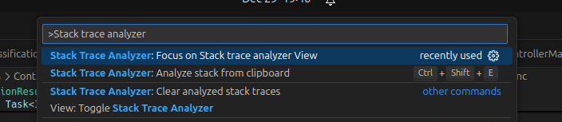
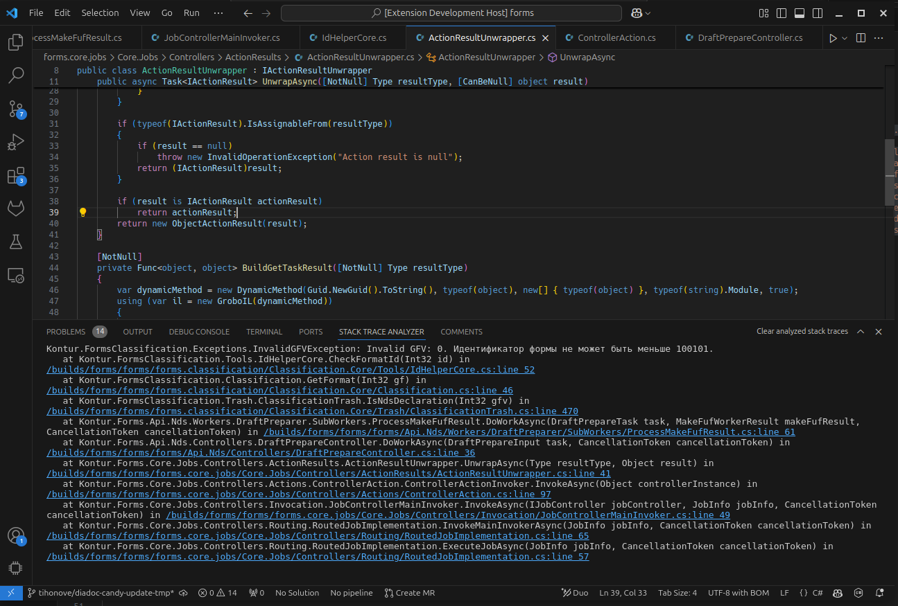

# Stack trace analyzer

Stack trace analyzer - Easy way to analyze stack traces from any language and sources.

## Features

- Analyze stack traces from clipboard with a single command.
- Automatically highlights and links file paths and line numbers in stack traces.
- Supports any programming language as it uses the built-in index.
- Handles stack traces even if paths partially do not match (e.g., due to CI builds).

## Commands

- `Analyze stack from clipboard`

## Usage

1. Copy a stack trace to your clipboard.
2. Run the `Analyze stack from clipboard` command.
3. The stack trace will be analyzed and displayed in the panel with clickable file paths and line numbers.

## Troubleshooting

If your stack trace is not working, please open an issue on [GitHub](https://github.com/tihonove/vscode-stack-trace-analyzer/issues).
Successfully tested on C# and JavaScript projects, but it should work well with any stack traces that contain file paths resembling source code.

## License

MIT License